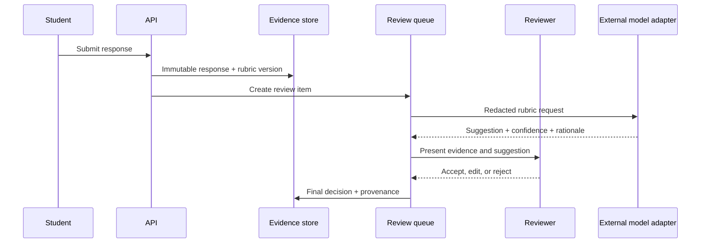

# AI-Assisted Marking Boundary

## Purpose

AI can help suggest rubric evidence or draft feedback for open responses. It should not silently become the source of truth for a high-consequence result.

## Guardrails

- Keep the original response and rubric version immutable.
- Minimise or redact personal data before external model calls.
- Record model/version, prompt policy identifier, timestamp, confidence, and reviewer action.
- Require human review below a documented confidence threshold or for sensitive assessments.
- Never present a generated suggestion as a verified fact without a reviewer decision.
- Provide a deterministic/manual fallback when the model is unavailable.
- Define retention, provider terms, regional processing, and deletion before sending data externally.

## Evaluation

Evaluate agreement with a human-marked sample, false-positive/false-negative patterns, subgroup impact, reviewer override rate, and latency/cost. Do not publish an accuracy percentage without a named dataset, rubric, sampling method, and evaluation date.

## Scope boundary

This case study does not claim that AI marking is deployed in any employer or education product. It documents a safer architecture for considering the capability.
