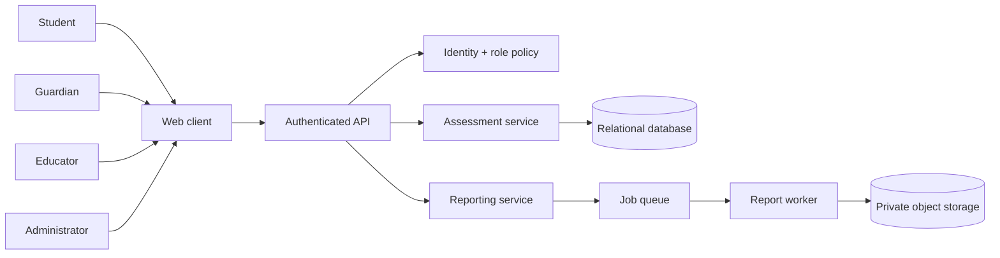

# Platform Architecture

## Actors and boundaries

The API is the boundary for role-aware commands and reads. The assessment service owns attempt state and scoring evidence. Reporting consumes stable assessment results and produces read models/exports asynchronously so large reports do not block an assessment submission.

## Authentication and roles

- Students can view assigned assessments and submit their own attempts.
- Guardians can view authorised dependent summaries, not private educator notes.
- Educators can create content and view permitted cohort reports.
- Administrators manage configuration and access, with audited privileged actions.

Authentication proves identity; policies evaluate role, organisation/centre scope, resource ownership, and entitlement. A role label alone is not sufficient authorisation.

## Deployment shape

Use a stateless web/API tier, relational database, Redis-backed queue/cache, worker processes, and private object storage for generated reports. Health/readiness endpoints should be separate from user-facing business responses. Secrets belong in a managed secret store; local examples use placeholders only.

## Failure handling

- Assessment submission commits answers and scoring inputs transactionally.
- Report generation is asynchronous and retryable; duplicate jobs are idempotent by report key.
- Notification delivery is best-effort and must not change the recorded assessment result.
- A failed AI suggestion falls back to human review or a deterministic rubric.
- Destructive account/data actions require explicit audit events and retention rules.
