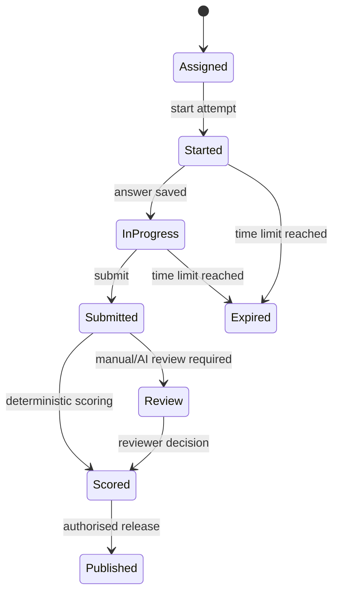

# Assessment Engine

## Attempt lifecycle

The state machine prevents answer changes after submission and makes expiry explicit. Every transition records actor, timestamp, and reason. Server-side timestamps are authoritative; client timers are presentation only.

## Question selection and versioning

An assessment references a versioned blueprint. The blueprint records eligible question IDs, difficulty/skill tags, ordering policy, and scoring rules. A published attempt stores a snapshot of the selected questions and rubric versions so later content edits cannot silently change historical results.

## Timing and submissions

- Create the attempt and its server-side start time in one transaction.
- Save draft answers only while the attempt is active.
- On submission, lock the attempt, validate answer shape, record a final payload hash, and enqueue any non-deterministic marking.
- Make submission idempotent by attempt ID and a client request key.

## Scoring

Deterministic objective questions are scored synchronously from versioned answer keys. Subjective or assisted marking produces a separate review record with rubric version, model/human actor, confidence, and decision. The final result keeps both raw evidence and the derived score.

## Testing priorities

- Boundary cases around expiry and timezone handling.
- Repeated submission requests.
- Content version changes after an attempt starts.
- Authorisation across student/guardian/educator roles.
- Score reproducibility from stored snapshots.
