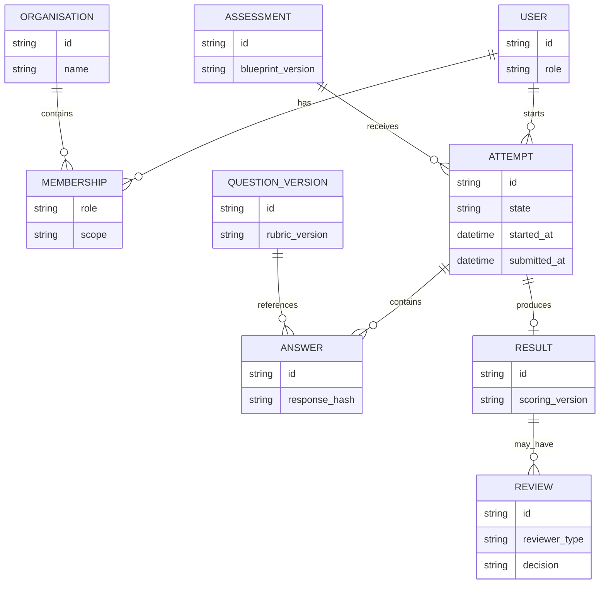

# Data Model

Important constraints:

- Attempt ownership and organisation scope are checked together.
- Answers are immutable after submission.
- Results point to the scoring/rubric versions used.
- Reviews preserve reviewer/model provenance and cannot overwrite raw evidence.
- Unique keys make submission and report generation idempotent.
