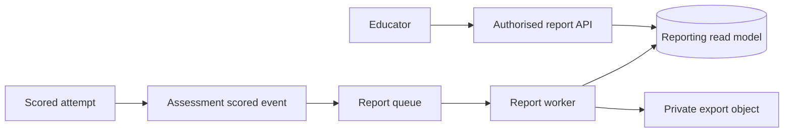

# Reporting and Data Access

## Read model flow

Reporting should read stable, published assessment results rather than re-running scoring on every page load. A read model can be rebuilt from immutable assessment evidence when the reporting projection changes.

## Access controls

- A student sees only their own permitted results.
- A guardian sees only explicitly linked dependents and allowed summary fields.
- An educator sees only assigned cohorts/centres.
- An administrator's broad access is still logged and reviewable.
- Export links are short-lived, scoped, and never indexed publicly.

## Retention and privacy

Define retention by assessment type and jurisdiction before implementation. Separate personally identifying data from reporting dimensions where practical. Deletion/anonymisation workflows must account for database rows, caches, search indexes, exports, logs, and backups.

## Failure handling

Report generation is retryable and idempotent. A stale report must be labelled with its generated-at timestamp and source version. If an export fails, the assessment result remains available through the normal API; reporting failure must not corrupt source evidence.
